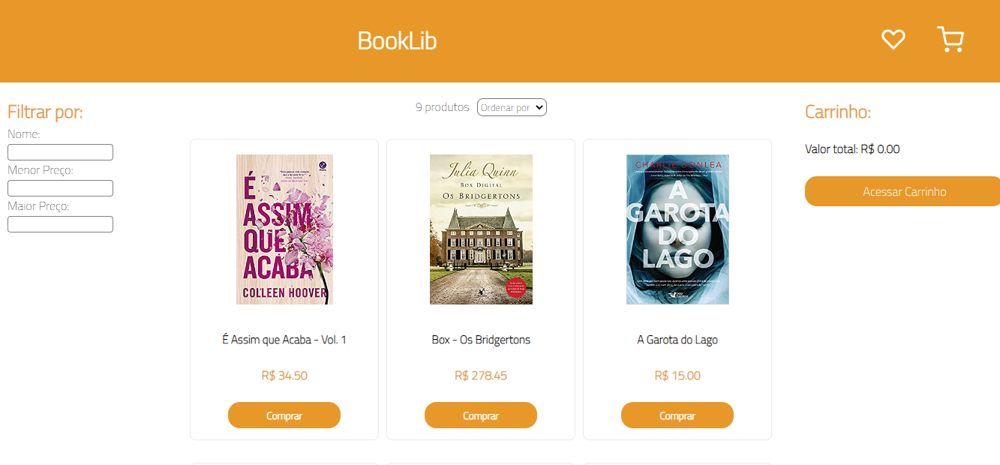

# BookLib

## 📄 Introdução

E-commerce de livros, em que possível visualizar os produtos, ordenar por preço, buscar por nome e adicioná-los ao carrinho para realização da compra.

[Clique aqui para acessar o projeto](https://booklib-frontend.vercel.app/)

## ⚒️ Tecnologias 

## 📫 Contato

E-mail: marianaceott@gmail.com

